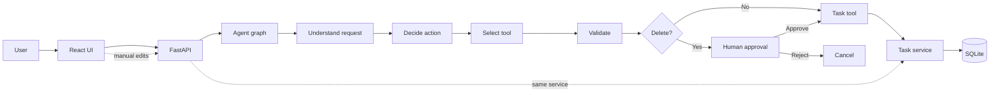

# Agentic Task Manager

A task manager you can talk to. Ask in plain English to create, list, search, update, complete or delete tasks; a single, bounded agent turns the request into a validated action, runs one allowlisted tool, and reports back only what the database confirms. The task workspace beside the chat shows the same data, with live metrics.

> The model understands. Application code validates. Tools execute. The database proves the result.

## What it does

- Chat assistant + task workspace (split view on desktop, tabs on mobile)
- Natural-language create / list / search / update / complete / delete
- Relative dates ("tomorrow at 8 PM", "Friday at 5 PM") interpreted in the user's timezone
- Follow-ups such as "make it high priority" (bounded context, see below)
- **Delete always asks for confirmation** — the graph pauses before any side effect
- Ambiguous requests ("complete the API task" with two API tasks) ask instead of guessing
- Metrics: Total / Open / Completed / Overdue, computed from the database
- Manual controls (new, edit, complete/reopen, delete) that use the same service layer as the agent's tools; the checkbox toggles Open ⇄ Completed, and the list changes only after the server confirms
- A collapsed "Activity" disclosure on each assistant reply showing the safe workflow steps
- The chat survives page reloads and backend restarts: the browser keeps its conversation id in `localStorage`, and the saved messages (with their Activity steps) are loaded when the page opens

## Architecture



```text
React + TS + Tailwind + TanStack Query
        ↓
FastAPI + Pydantic
        ↓
LangGraph workflow  →  structured ActionPlan (LLM)
        ↓
Guardrails + task-reference resolution
        ↓
Allowlisted tool → TaskService → TaskRepository → SQLAlchemy → SQLite
```

## Agent workflow

`understand → decide → resolve target → select tool → validate → [approval] → execute → verify → return`

| Step | What happens |
| --- | --- |
| Understand | The model returns a typed `ActionPlan` (intent, fields, target reference). Nothing executes. |
| Decide | Unsupported requests, bulk actions and missing details stop here with a clear reply. |
| Resolve | ID → "it" (last task) → exact title → partial title → text search. 0 matches: not found. 2+: ask. |
| Select tool | Code maps the validated intent to one of six tools. The model never names a tool. |
| Validate | Arguments are parsed against the tool's strict schema, plus business rules. |
| Approval | Delete only: the graph pauses (`interrupt`) with the exact task shown to the user. |
| Execute | The tool calls `TaskService`. Domain errors become readable messages. |
| Verify | The result is re-read from the database before any success message is produced. |

## Tech stack

Backend: Python 3.12, FastAPI, Pydantic, SQLAlchemy, SQLite, LangGraph, LangChain.
Frontend: React, TypeScript, Vite, Tailwind CSS, TanStack Query.
Tests: pytest.

## Setup

Prerequisites: [uv](https://docs.astral.sh/uv/) (installs Python for you) and Node 20+.

```bash
cp .env.example .env        # then put your key in .env (git-ignored); never in .env.example
```

### Environment variables

| Variable | Default | Purpose |
| --- | --- | --- |
| `ANTHROPIC_API_KEY` | — | Key for the language model that interprets requests. Without it the app runs, but the assistant replies that it can't interpret requests (tasks are never changed). |
| `MODEL_NAME` | `claude-sonnet-5` | Model used for request understanding. |
| `DATABASE_URL` | `sqlite:///./tasks.db` | Where tasks are stored. |
| `CORS_ORIGINS` | `http://localhost:5173` | Allowed browser origins. |

`.env` is git-ignored; only `.env.example` (placeholders only) is committed. The server looks for `backend/.env` then the repo-root `.env`, regardless of the directory you start it from, and logs one startup line such as `env_file_found=True anthropic_key_configured=True` (never the key itself). `GET /api/health` reports `assistant_configured`.

**Troubleshooting "I couldn't interpret that request right now."** The reason is in the backend log, on the `operation=understand status=failure` line (`error_type=…`, `error=…`, plus a traceback). Keys are masked in all logs. Typical causes: no `.env` found / empty key (`AssistantNotConfigured`), a rejected key (`AnthropicAuthenticationError`, 401), or an unavailable model name. Restart the server after editing `.env`.

### Run the backend

```bash
cd backend
uv run uvicorn app.main:app --reload --port 8000
```

### Run the frontend

```bash
cd frontend
npm install
npm run dev          # http://localhost:5173 (proxies /api to :8000)
```

### Deploying the frontend and backend separately (e.g. two Vercel projects)

The frontend calls relative `/api/...` URLs. Locally the Vite dev server proxies them to the backend, so nothing needs configuring. When the frontend is hosted on a different domain from the backend, set this **build-time** variable on the frontend project, then redeploy:

| Variable | Example | Notes |
| --- | --- | --- |
| `VITE_API_BASE_URL` | `https://your-backend.vercel.app` | The backend **origin only**: no trailing slash and no `/api` (a trailing `/` or `/api` and a missing `https://` are tolerated). Leave empty for local development. |

Vite bakes `VITE_*` values into the JavaScript when it builds, so changing the variable requires a **new build/redeploy**; it has no effect on an already-deployed bundle. On the **backend** project, `CORS_ORIGINS` must list the frontend's exact origin (comma-separated for several), e.g. `https://your-frontend.vercel.app`; preview URLs are different origins and must be listed too if you use them. To check a deployment, open DevTools -> Network -> Fetch/XHR: requests should go to `https://your-backend.vercel.app/api/...` (not the frontend's own domain) and return 200.

On an empty database the workspace offers **Load demo data** (8 tasks, including two "API" tasks and a "Fix production deployment" task). It never overwrites existing tasks.

## Example prompts

```text
Create a task called "Prepare demo".
Create a high-priority task to finish the interview demo tomorrow at 8 PM.
Show my open tasks.
Show my high-priority open tasks.
Find tasks related to API testing.
Move the API integration tests task to Friday at 5 PM.   → then: Make it medium priority.
Mark task 4 complete.
Complete the API task.            → asks which one (two matches)
Delete the deployment task.       → confirmation dialog
Email my manager.                 → not supported, nothing happens
Delete all tasks.                 → bulk actions rejected
```

## Human-in-the-loop delete

1. The agent resolves exactly one task (read-only) and pauses with `interrupt(...)`. **No side effect happens before the pause.**
2. The UI shows "Delete task? #18 — Fix production deployment. This action cannot be undone."
3. **Cancel** resumes the graph with `false` → cancellation branch, no database change.
4. **Delete** resumes the same thread with `true` → the separate `delete_exec` node re-reads the task, checks it hasn't changed since the dialog was shown, then deletes and verifies the row is gone.

`delete_task` has no `confirmed` parameter (its schema forbids extra fields). Approval is control-flow state, not model data: the only edge to `delete_exec` is the approved branch, the generic tool executor refuses `delete_task`, and the delete function requires an `ApprovalToken` bound to that exact task that only the approval branch can issue. `/api/agent/resume` returns 409 unless the thread has a pending interrupt, so approvals can't be replayed or invented.

## Guardrails (enforced in code)

- Domain boundary: unsupported requests execute nothing
- Typed model output (Pydantic); invalid output means no action
- Six-tool allowlist; intent → tool mapping is done by code
- No LLM-generated SQL; all queries are parameterised, and `%`/`_` in search text are escaped
- Task IDs the model "invents" are ignored — an ID is used only if the user wrote it or it's the last task in context
- Ambiguous target → no update / complete / delete
- Bulk destructive actions rejected (quoted text is ignored, so a task *titled* "delete all…" can still be created)
- Stored task text is untrusted data: it is never fed back as instructions, only displayed
- Business rules re-checked after schema validation (blank/long titles, empty updates, bounded limits)
- Success is reported only after the database read-back confirms it; no automatic retries of mutations
- Input limits on message, title, description and result counts
- Safe errors: no stack traces, keys or internals reach the UI; details go to backend logs

## Conversation history API

`GET /api/conversations/{thread_id}/messages[?limit=N]` returns the saved messages of one conversation, most recent `limit` (default 50, **maximum 200**), **oldest first** (ordered by insertion id, so ties in timestamps are still deterministic):

```json
[{"id": 1, "role": "user", "content": "…", "status": null, "steps": null, "created_at": "2026-09-21T10:40:19Z"},
 {"id": 2, "role": "assistant", "content": "…", "status": "success", "steps": [{"key": "understand", "label": "…", "status": "done", "detail": "…"}], "created_at": "…"}]
```

| Situation | Response |
| --- | --- |
| Conversation exists / is empty / is unknown | `200` with a list (empty for the last two, which are indistinguishable) |
| `thread_id` not matching `^[A-Za-z0-9_-]{1,100}$` | `422` |
| `limit` below 1, above 200, or not an integer | `422` |
| Database unavailable | `503` `{"detail": "Conversation history is temporarily unavailable."}` |
| Unexpected error | `500` `{"detail": "Something went wrong."}` |

Errors never include SQL, tracebacks or message text, and neither do the logs (they record the operation, thread id, result count and the failure type only). Responses carry `Cache-Control: no-store`. Only the newest page is reachable in this version (no paging back through older messages).

> **Security limitation, resolve before any production exposure.** There is **no authentication and no conversation ownership**: the `thread_id` (a random UUID made by the browser) is the only credential, so anyone who knows or obtains it can read that conversation. The thread id also appears in server and access logs. Row-level security is currently **disabled** on the Supabase tables, so this API layer is the only access control. Before exposing this beyond a trusted environment: add authentication, associate each conversation with its owner and check it on every request, and enable RLS. Mitigations already in place: access by exact id only (no list or search endpoint), unknown and empty conversations look the same, bounded page size, and `no-store` caching.

## Metrics

`Total` = all tasks · `Open` = pending · `Completed` = completed · `Overdue` = pending with `due_at` in the past. All computed by SQL aggregates, refreshed after every agent or manual change.

## Tests

```bash
cd backend
uv run pytest
```

159 backend tests (plus 39 frontend tests, `npm test` in `frontend/`): service/repository behaviour, agent routing per intent, API flows, and the mandatory guardrail suite (delete without approval, cancelled delete, unsupported intent, ambiguous target, bulk delete/complete, stored prompt-injection text, invalid structured output, DB failure without fake success, SQL-like input, changed-during-approval).

The agent tests replace the model with a scripted planner returning `ActionPlan` objects, so they exercise everything except the model call itself.

Frontend: `npm test` (Vitest: the complete/reopen checkbox, including after a failed request) and `npm run build` (typechecks and builds).

## Design decisions

- **One agent, one graph.** Task management is one cohesive domain; more agents would add cost without capability.
- **Structured output over tool-calling by the model.** The model only produces a plan; deterministic code picks and runs the tool.
- **SQLite + repository layer.** Real persistence with no infrastructure; the layer keeps a PostgreSQL move simple.
- **Search is SQL `LIKE` on title and description.** The search tool matches individual words (lightly stemmed) ranked by how many match, so "API testing" finds "API integration tests". Resolving a task to update/complete/delete stays strict (whole phrase), so a fuzzy match can never pick a mutation target. No embeddings or vector store are needed for small structured data.
- **Timestamps stored in UTC**; the user's timezone is used only to interpret and display dates. Naive datetimes from the model are interpreted in the user's timezone.
- **Bounded, saved context.** Each chat turn (including clarifications and errors) is saved to the database, with the conversation's last task ID. Before each turn the last few saved messages and that task ID are given to the model, enough for "make it high priority" even after a restart. Saving is best-effort: a storage failure is logged (without chat text or SQL) and never affects task operations.
- **Product-style UI.** No framework or model branding, no raw logs or payloads; the activity disclosure shows workflow steps only.

## Known limitations

- A pending delete confirmation lives only in memory (by design, so an approval can never outlive the server). After a restart, resuming it returns 409 and the user simply asks again. Tasks and saved conversations persist in the database.
- A new message sent while a delete confirmation is pending cancels that delete.
- The manual edit form can't clear an existing due date.
- The assistant can't reopen a task (only the checkbox can); it has the six original tools.
- There is no "New conversation" button: one browser profile keeps one conversation (clear the site's `localStorage` to start over). Tabs of the same browser share it, and only the newest 50 messages are shown on load.
- A delete confirmation still can't be restored after a reload: the unresolved message is shown as expired and the user asks again. Sending any new message abandons the old confirmation.
- The conversation id in `localStorage` is the only thing tying a browser to its history (see the security limitation under *Conversation history API*).
- Single user, no authentication.
- The live model call is not covered by the automated test suite (the agent tests use a scripted planner). It was exercised manually end-to-end in a browser; model wording for clarification questions can vary between runs.

## Production improvements

PostgreSQL, authentication and per-user data isolation, a durable checkpointer, idempotency keys for mutations, rate limiting, an audit log, monitoring/alerting, a CI/CD pipeline, and a larger evaluation suite for the language-understanding step.
